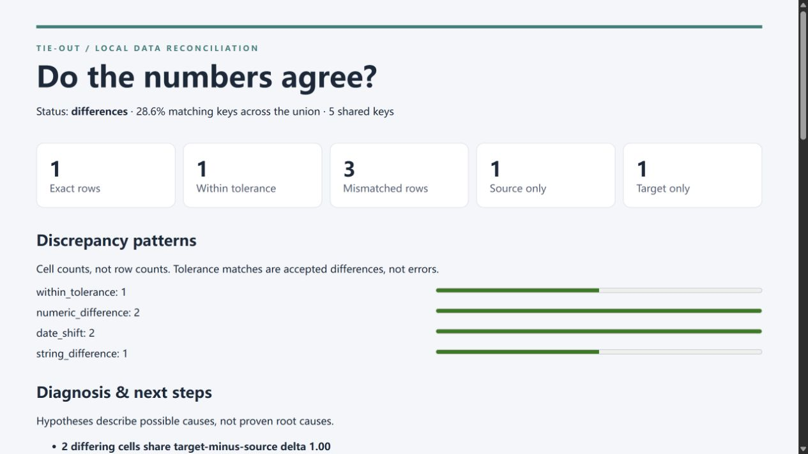

# Tie-Out — Reconcile CSV, Excel, and SQL Server data

Find mismatched records, explain differences, and generate readable HTML reports—with precise decimal comparisons and configurable tolerances.

[](https://github.com/Chris-LongZeyan/tie-out/actions/workflows/tests.yml)
[](https://sonarcloud.io/summary/new_code?id=Chris-LongZeyan_tie-out-public&branch=main)
[](https://sonarcloud.io/component_measures?id=Chris-LongZeyan_tie-out-public&metric=reliability_rating&view=list)
[](LICENSE)

Tie-Out is a Python command-line tool and Codex skill for reconciling two datasets. It matches records by a unique single or composite key, applies numeric and date tolerances, and reports differences in an aggregate JSON summary and a self-contained HTML report. The skill explains recurring patterns and suggests follow-up checks; diagnostic findings are hypotheses, not confirmed causes.



*Report preview from the bundled synthetic example.*

## Quick start

Python 3.10 or later is required. CSV comparisons use only the Python standard library. Run the following commands from a terminal:

```sh
git clone https://github.com/Chris-LongZeyan/tie-out.git
cd tie-out
python skills/tie-out/scripts/tie_out.py compare examples/prices_source.csv examples/prices_target.csv --key record_id --out reports/demo
```

Open `reports/demo/report.html` in a browser. The synthetic example produces **1 exact row, 1 row within tolerance, 3 mismatched rows, 1 source-only row, and 1 target-only row**. The match rate is **2 / 7 = 28.6%**, calculated over the union of keys. Use a new output directory when running the comparison again.

For Excel input, install the optional dependency:

```sh
python -m pip install -r skills/tie-out/requirements.txt
```

For SQL Server input, install the optional dependency and a Microsoft ODBC driver:

```sh
python -m pip install -r skills/tie-out/requirements-mssql.txt
```

## Capabilities

| Capability | Behavior |
| --- | --- |
| Inputs | CSV, value-only XLSX, SQL Server SELECT results |
| Keys | Exact single or composite keys; nonblank and unique |
| Numbers | Decimal arithmetic with inclusive absolute tolerances |
| Dates | ISO dates/timestamps with explicit day-based tolerances |
| Schema | Added and removed columns reported separately |
| Diagnostics | Repeated offsets, missing keys, optional suggestions for similar unmatched keys |
| Outputs | Aggregate JSON summary, HTML report, and exit codes for automation |

## Install the skill in Codex

Ask Codex's built-in installer:

```text
Use $skill-installer to install skills/tie-out from
https://github.com/Chris-LongZeyan/tie-out
```

Alternatively, copy the complete `skills/tie-out` directory into your user skill directory. For a new installation, run one of the following examples from the repository root.

Windows PowerShell:

```powershell
New-Item -ItemType Directory -Force "$HOME/.agents/skills" | Out-Null
Copy-Item -Recurse skills/tie-out "$HOME/.agents/skills/tie-out"
```

macOS or Linux:

```sh
mkdir -p ~/.agents/skills
cp -R skills/tie-out ~/.agents/skills/tie-out
```

For a project-scoped installation, copy the directory to `.agents/skills/tie-out` within that project. To update an existing installation, replace its contents without creating a nested `tie-out` directory. Install the optional dependencies above in the Python environment Codex uses. If the skill does not appear, restart Codex. See the [official skill documentation](https://learn.chatgpt.com/docs/build-skills) for installation details.

Then ask:

```text
Use $tie-out to reconcile source.csv and target.xlsx by trade_id.
Use the Prices worksheet in target.xlsx. Compare amounts within 0.01.
Explain the main differences and give me the HTML report.
```

If you do not specify a key, the skill profiles both inputs and asks you to confirm an appropriate identifier. The Python tool can also run independently of Codex and does not require an API key.

## Documentation

- [Usage guide](docs/usage.md): comparison rules, composite keys, tolerances, outputs, and exit codes.
- [SQL Server integration](docs/sql-server.md): setup, permissions, examples, and troubleshooting.
- [Contributing](CONTRIBUTING.md): repository structure, test commands, and quality checks.
- [Code of Conduct](CODE_OF_CONDUCT.md): community standards and incident reporting.
- [Security Policy](SECURITY.md): supported releases and private vulnerability reporting.
- [Evaluation methods and results](evaluations/README.md): reproducible benchmarks and live SQL acceptance tests.

## Measured performance

On the 2026-09-27 synthetic benchmark, comparing two 500,000-row CSV files and writing a report took **4.17 seconds**, down from **13.90 seconds** in the previous version. DataComPy 1.0.4 took **6.07 seconds** on the same fixture. These are medians of three fresh processes on Windows with Python 3.13.7.

The fixture has six columns, repeated values, and mostly matching rows. Tie-Out used 645 MiB of peak memory; DataComPy used 431 MiB. Results depend on data shape and comparison rules. See the [methodology and raw measurements](evaluations/assessment.md#current-benchmark-2026-09-27) for scope and reproduction instructions.

## Privacy and limitations

File comparisons run locally without network calls. SQL Server input connects to the configured database. When used through Codex, aggregate results are processed under your Codex service settings. HTML reports contain sampled values and keys; review them before sharing. The tool omits connection strings from reports and error messages.

Both datasets must fit in memory. Suggestions for similar keys never count as matches. Automatic corrections, complete mismatch exports, and three-way reconciliation are not supported. The [benchmark assessment](evaluations/assessment.md) describes measured performance, methodology, and limitations.

Only synthetic fixtures belong in this repository. Never attach customer data, private exports, or credentials to an issue or pull request.

## License

Distributed under the [MIT License](LICENSE).
